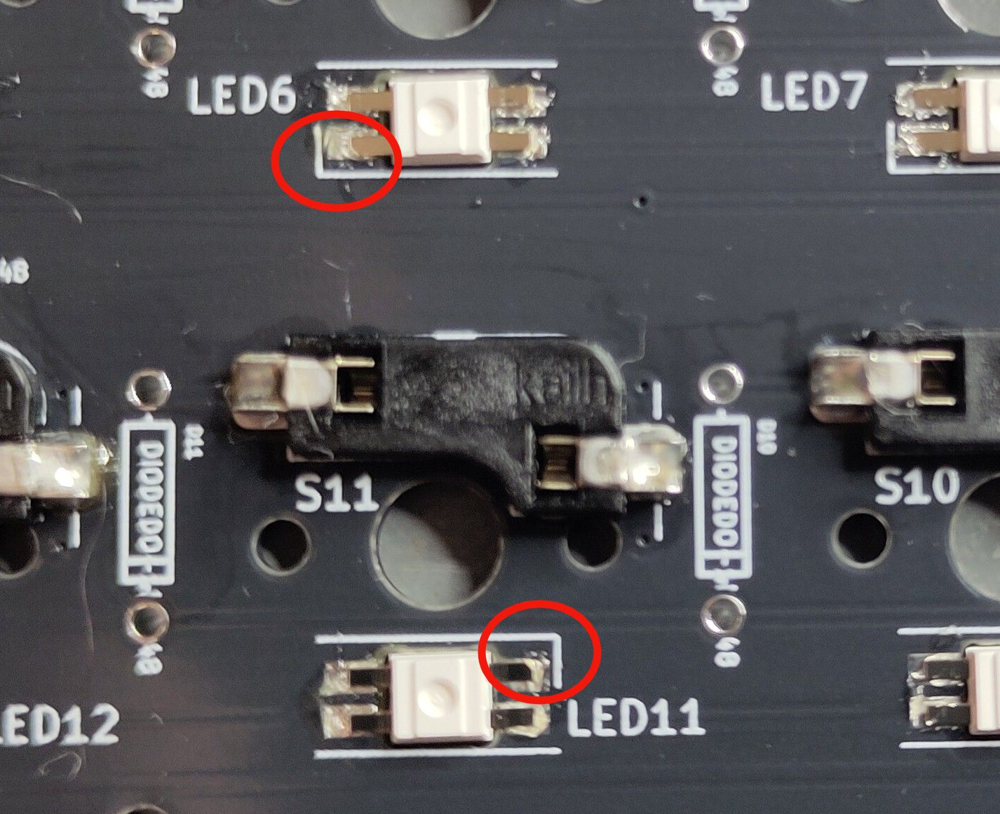
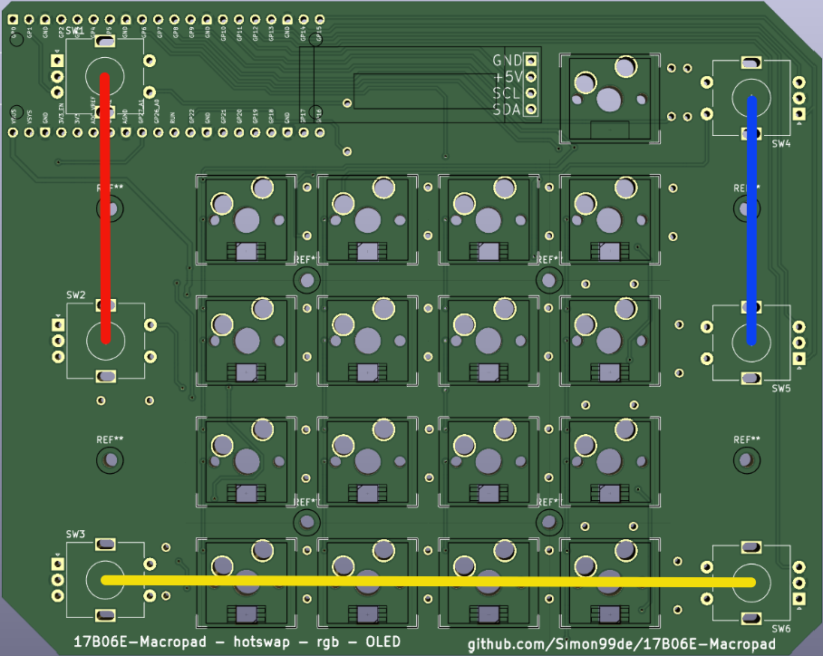

# 17B06E-Macropad
Simple 4x4 (+1) numpad with 6 rotary encoders. Powered by QMK via Waveshare RP2040-Plus / Raspberry Pi Pico (1). 

### What does 17B06E mean?
I chose the name 17B06E-Macropad because it describes everything the Macropad has. 17 Buttons + 6 Encoders. It also has RGB and a small OLED display.
The top button is used to switch profiles, giving you 16 x 4 (or more/less) buttons at your disposal, with the current profile shown on the display.

### sources / what was used:
* I used the KiCad template from [dumbpad](https://github.com/imchipwood/dumbpad/) to create this project. 
* Many thanks to the developer who made the firmware and thus the project possible: [FabiClawZ](https://github.com/FFS2309)

## Gallery

## Getting Started
To build your own 17B06E Macropad, you must first follow a few steps. The following describes the minimum requirements you need to assemble a 17B06E-Macropad. 
### 1. Choose version. 
Currently, there is only one version available.
The firmware is located in the [firmware](firmware/) folder.
### 2. Order your parts. 
Every board needs at least the following components but check the right folder for your parts list.
* 1x PCB (gerber file)
* 17x Kailh Hotswap Sockets (rev 2)
* 17x MX-style mechanical switches
* 17x Keycaps (I use the AXYB keycap, where you can remove the cap. There is also a u1 version.)
* 22x 1n4148 diodes (thru hole)
* 1x Waveshare RP2040-Plus, Raspberry Pi Pico or pin-compatible MCU based on RP2040
* 2x 1x20 Pin header (or mcu, where it is pre-soldered)
* 6x EC11 rotary encoder with pushbutton (7-pin)
* (optional) 1x 0.91" 128X32 OLED Display (Please note the pinout (I2C); there are different ones, and it must also be +5V compatible.)
* (optional) 1x 1x4 male headers (Pin header male and female for the OLED display)
* (optional) 1x 1x4 female headers
* (optional) 16x SK6812 mini e LEDs
* (recommended) 8x M2x12 Hexagon socket head cap screws - DIN 912 (ISO 4762) - (for the case to be screwed together)

### 3. Assemble your 17B06E-Macropad
For this step you will need a minimum of a soldering iron and a pair of tweezers
- Solder the diodes, Hotswap Sockets, Rotary Encoder, (LEDs) and MCU (Pi Pico) to the PCB
- When testing, do not look directly into the LEDs, as they are very bright!
You can also see the LEDs on the back when they are lit, but not as brightly. Use keycaps.

#### Notes on soldering

It's recommended to start with the Sockets and then add the remaining parts.

The encoders must be soldered before the MCU!

Solder the SK6812 LEDs with the missing corners aligned with the corners printed on the PCB as shown in the image.

*NOTE:* the orientation of the LEDs changes between the lines!

### 4. Flash your firmware
##### Enter bootloader mode:
The method varies for other boards, but on the Pi Pico for example you can hold the BOOTSEL button while plugging it in and it should also enter the bootloader.
Alternatively you can bind the `QK_BOOT` key and press it to have the MCU reboot into bootloader. By default this is bound to the press of the bottom right encoder on the second layer.

The controller should reboot and enter the bootloader mode automatically - you will see a flash drive pop up on you PC called RPI-RP2

##### Copy firmware:
You can take your *.uf2 file and copy it to the mounted drive. It will unmount and reboot itself. If the firmware flashing process succeeded, you will have a working keyboard. If not, please repeat the procedure. Since the bootloader is etched into ROM, it can’t be bricked. You are very unlikely to break something.

##### QMK (alternative option):
You can use QMK to create and flash firmware to your 17B06E-Macropad. You can configure every key using the QMK configurator. Head over to the [QMK configurator](https://config.qmk.fm/#/simon99de/17b06e/rgb) and select simon99de/17b06e/\[norgb|rgb\]. Once you have configured your board, click on compile and then on firmware to download the firmware. Check [qmk_firmware/keyboards/simon99de/17b06e](https://github.com/qmk/qmk_firmware/tree/master/keyboards/simon99de/17b06e) for compiling & uploading instructions

### 5. 3D printing case
I have uploaded the files for printing the housing to the various platforms.
The files and the FreeCAD file for modifications (mods/accessories) are also available here.
* [Github](/case/)
* [MakerWorld](https://makerworld.com/)
* [Printables](https://www.printables.com/)

**<ins>The links are not yet functional as they are still under development!</ins>**

### 6. Adjust buttons and decoders
There are several ways to change the keys. I will list them here:
* [QMK](https://config.qmk.fm/#/simon99de/17b06e/rgb)
* [VIA](https://www.usevia.app/) (Website, Recommended)
* [Vial Web](https://vial.rocks/) (Website, Recommended)
* [Vial Download](https://get.vial.today/download/) (Download, Beta)

## Other

### known issues
#### Control knob does not function
If one encoder no longer outputs, the other in the matrix is not turned to a snap point, causing the problem. SW1 + SW2, SW4 + SW5, and SW3 + SW6 are in one matrix. There are three matrices to prevent false outputs and still save pins.

So if, for example, the upper SW4 on the blue line does not work, then the encoder SW5 is not properly engaged.

