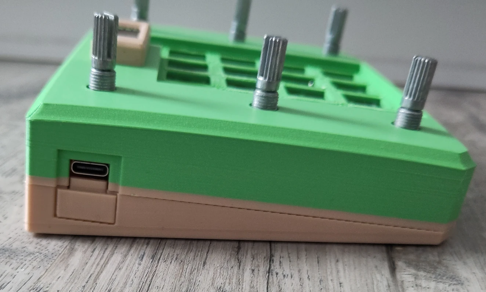
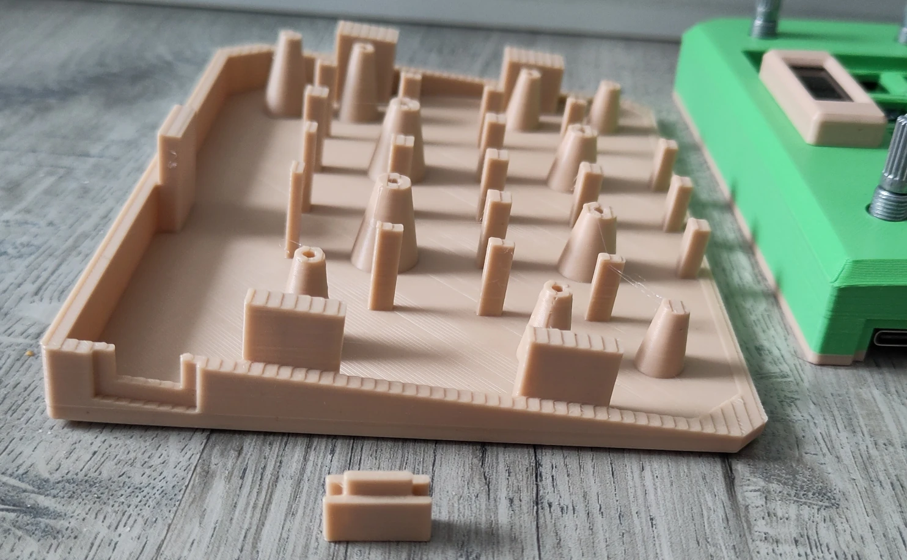
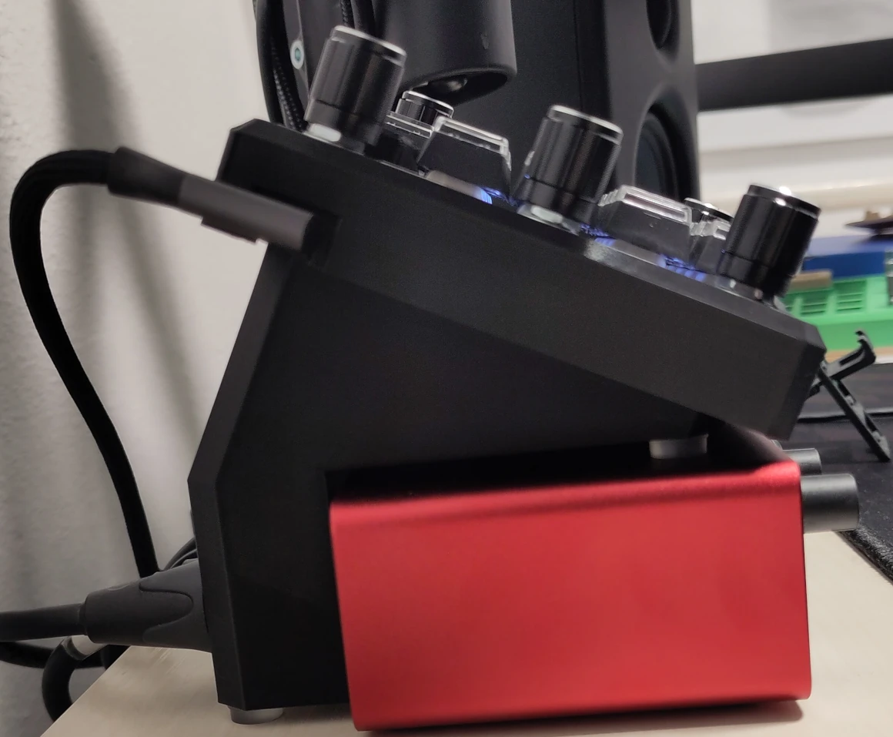
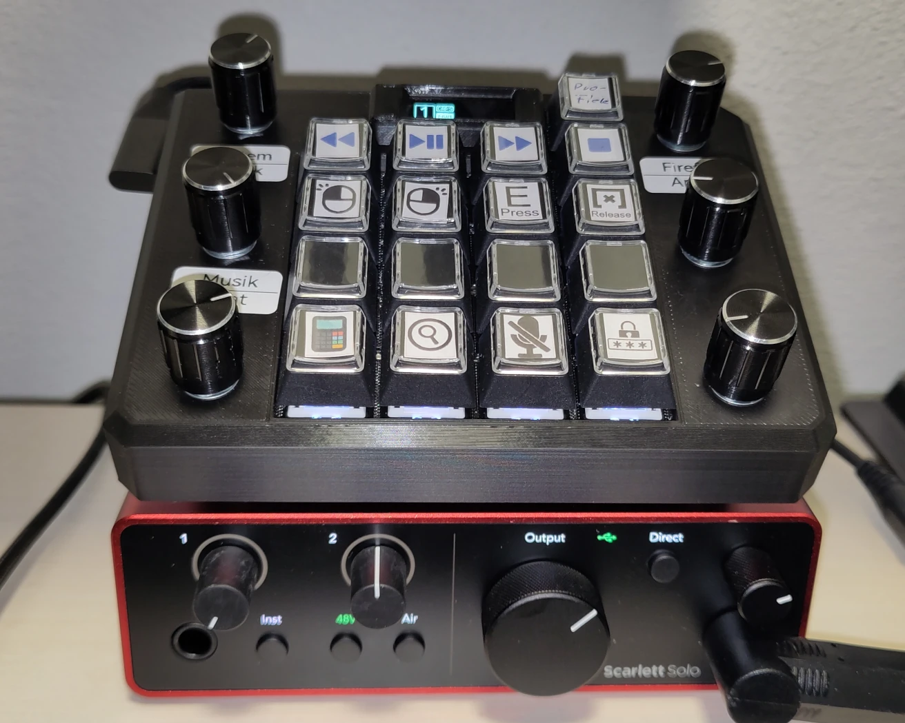

## Mods: 3D printing / CAD files
Various files are available here to help you customize Macrodeck.
Here you will find the 3D printing files and the FreeCAD file for creating mods.

If the file does not fit, please let me/the developer know so that I can adjust it for everyone. If you have created a mod, please let me know so that I can add a link to it if it is good. Please also use the remix function when uploading!

### Submit files
If you want to submit files, please write a short text below describing what your 3D model can do and add any other relevant information. 
You don't have to upload the files here, but you can, but you have to link to the free source!
As always, create a fork and send a pull request.

I accept no liability for damage or similar.

----------

## hotswap MCU
Developed by [Simon99de](https://github.com/Simon99de) 

Github File: [...Cover_v1-hotswap-MCU.stl](17B06E-Macropad-Case-Mod-Cover_v1-hotswap-MCU.stl) | [...USB-C-Cover_v1-hotswap-MCU.stl](17B06E-Macropad-Case-Mod-USB-c-Cover_v1-hotswap-MCU.stl)

external files: 
* MakerWorld: [17B06E Makropad (von Simon99DE)](https://makerworld.com/de/models/2140978-17b06e-macropad-by-simon99de)
* Printables: [17B06E Macropad (by Simon99DE)](https://www.printables.com/model/1523378-17b06e-macropad-by-simon99de)
* Thingiverse: [17B06E Macropad (by Simon99DE)](https://www.thingiverse.com/thing:7244721)

### Functions
With these files, it is possible to plug the MCU (Pico) into a female pin header and also have a slant.

Please note: I have not optimized this file. I have not tested it myself yet, as I have not built one with a header.
It would be great if you could contact me and let me know where I might need to make adjustments.

### Picture:
|   |  |
| ------------- | ------------- |

#### 
----------

## Scarlett-Solo-gen4 Top Mount
Developed by [Simon99de](https://github.com/Simon99de) 

Github STL File: [...Scarlett-Solo-gen4-Top_Stand.stl](17B06E-Macropad_Mod_Scarlett-Solo-gen4-Top_Stand.stl)

Github CAD File: [...Scarlett-Solo-gen4.FCStd](17B06E-Macropad_Mod_Scarlett-Solo-gen4.FCStd)

external files: 
* MakerWorld: [17B06E Makropad (von Simon99DE)](https://makerworld.com/de/models/2140978-17b06e-macropad-by-simon99de)
* Printables: [17B06E Macropad (by Simon99DE)](https://www.printables.com/model/1523378-17b06e-macropad-by-simon99de)
* Thingiverse: [17B06E Macropad (by Simon99DE)](https://www.thingiverse.com/thing:7244721)

### Functions
This is used to place the macropad on the Scarlett Solo Gen4. (Anti-slip or double-sided adhesive tape is recommended to prevent slipping).
I don't know if other generations also work.

### Picture:
|   |  |
| ------------- | ------------- |

#### 
----------
